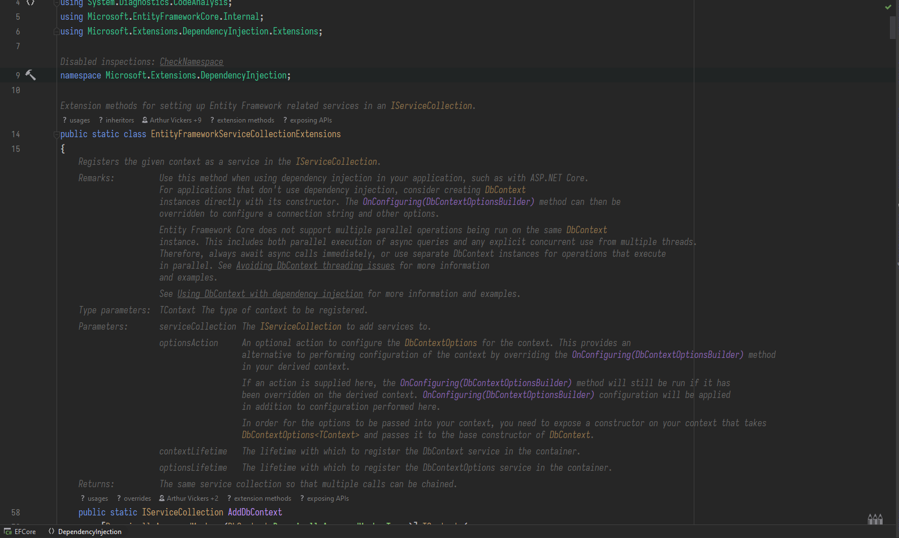
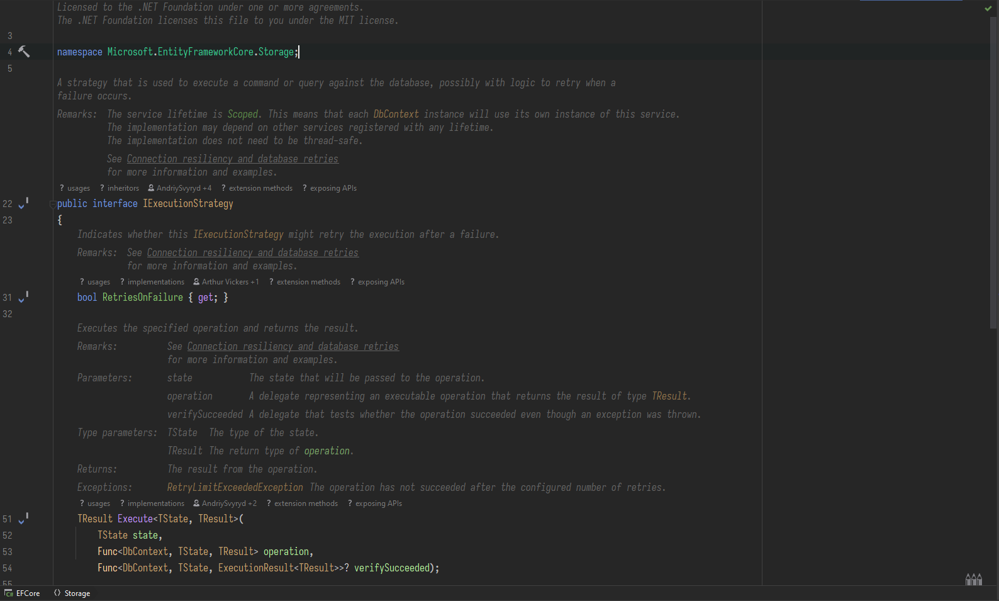
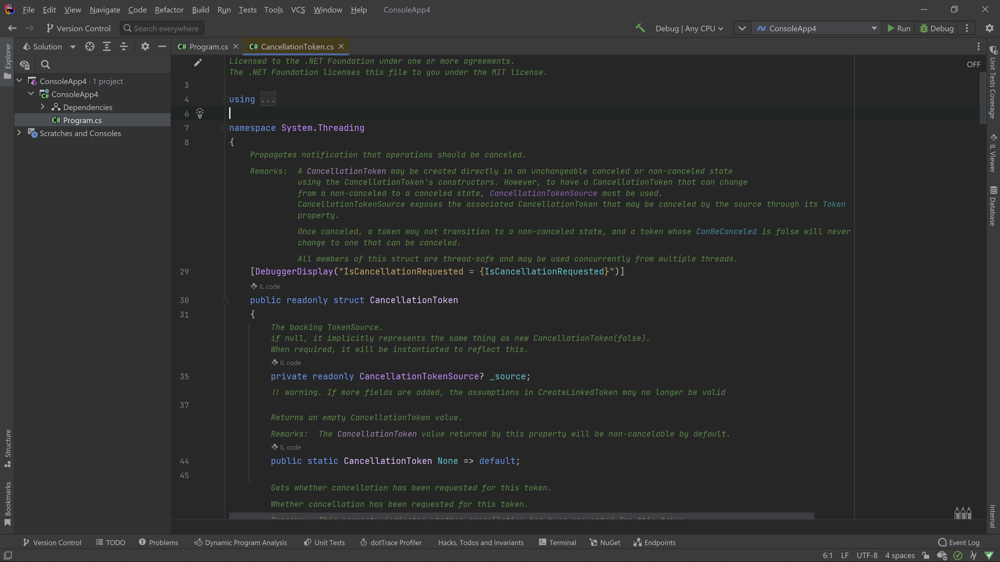
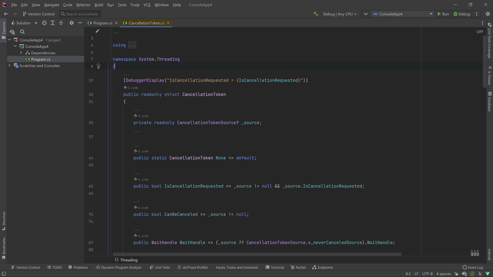
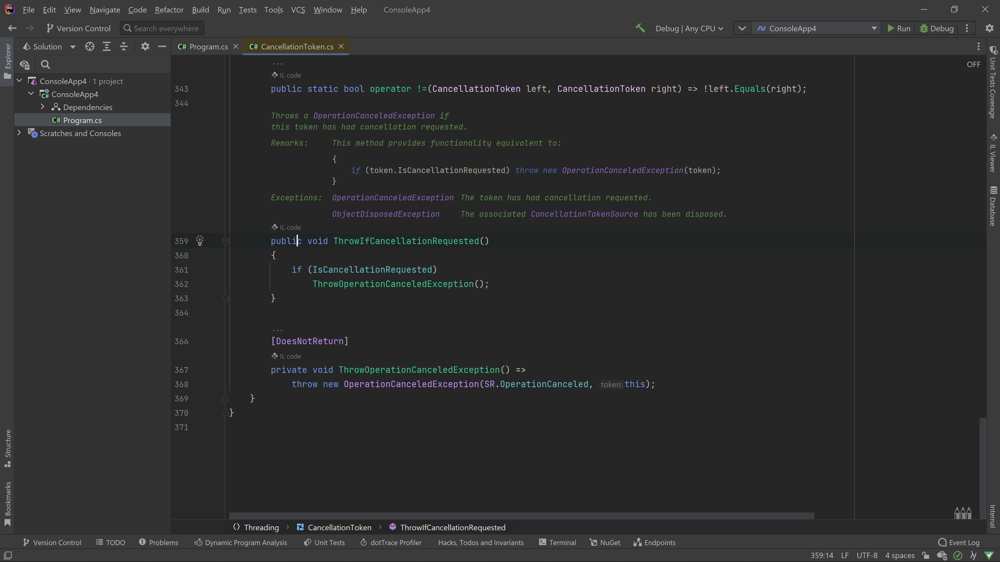
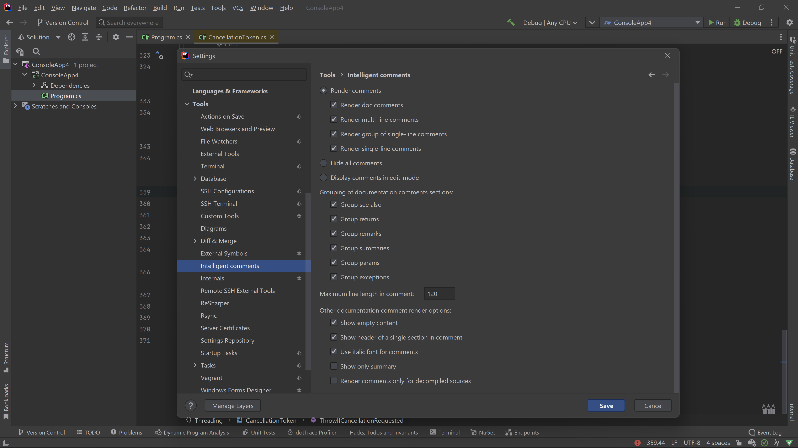
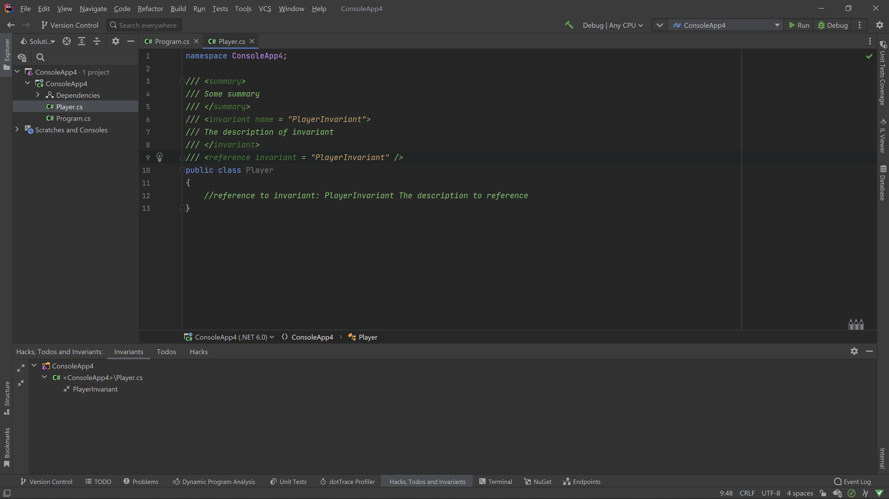

# IntelligentComments for Rider

Turn off Rider reader mode in order for this plugin to work properly (Settings -> Editor -> Reader Mode -> Enable Reader mode)

Intelligent Comments can be [downloaded](https://plugins.jetbrains.com/plugin/19135-intelligent-comments) from the JetBrains Marketplace. 

The plugin provides functionality to render comments:

The comments can be hidden in settings or by "Hide Or Render All Comments" action:

Plugin renders comments with interactive parts, processing "cref" and other active attributes. 
Moreover, the code examples are highlighted to the best extend:

Other minor features are: push-to-hint behaviour for rendered comments, pretty formatting of comments' text, some settings to customize which comments to render and view of rendered comments

The plugin also provides some experimental features to store the implicit dependencies in the code base in the documentation and single-line comments.
You can declare invariants, hacks or todos in documentation comments or in single-line comments.
Then you can declare references in documentation comments or single line comments, thus organizing the knowledge of the codebase with references and named entities. 
Plugin supports renaming, find usages of named entity, go to declaration from reference, plugin also collects all named entities in "Hacks, Todos and Invariants" tool window

